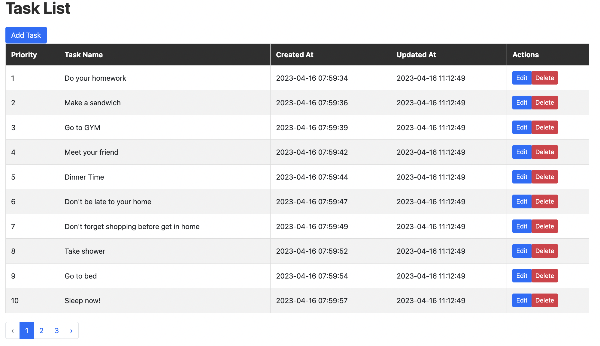

# Task Project

This project contains a task list on the home page. You can add a new task, edit an existing task, or delete a task from this page. You can also easily change the order of tasks by simply dragging and dropping the desired task row on the table.

## Requirements

- PHP 8.2.5
- Laravel 10.7.1

## Installation

1. Clone the repository:
git clone https://github.com/onrbzkrt/task-project.git
2. Navigate into the project directory:
cd task-project
3. Install dependencies:
composer install
4. Create a new `.env` file:
cp .env.example .env
5. Generate a new application key:
php artisan key:generate
6. Set up your database connection in the `.env` file.
7. Run the database migrations:
php artisan migrate
8. Serve the application:
php artisan serve

## Usage

1. Access the application by visiting `http://localhost:8000` in your web browser.
2. To add a new task, click the "Add Task" button and fill in the task form.
3. To edit an existing task, click the "Edit" button next to the task you wish to edit and make the desired changes.
4. To delete a task, click the "Delete" button next to the task you wish to delete.
5. To change the order of tasks, simply drag and drop the desired task row on the table.

## License

This project is licensed under the MIT License.

